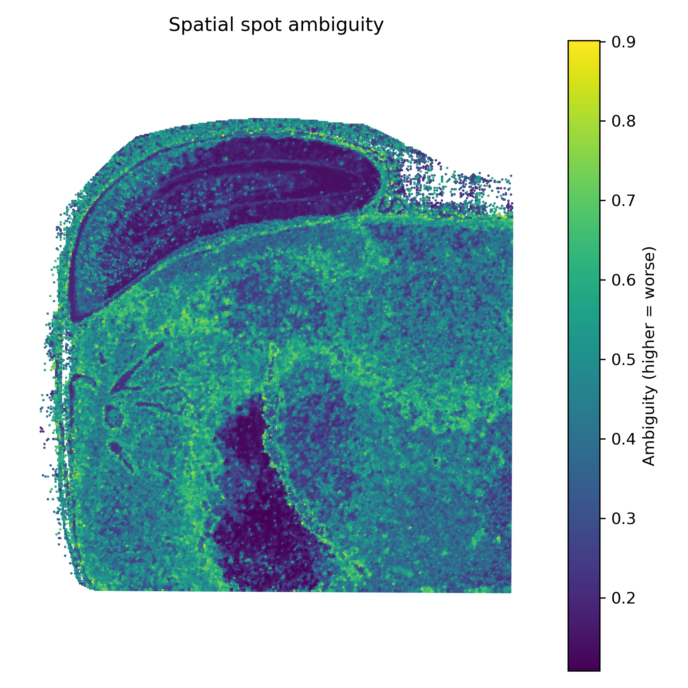
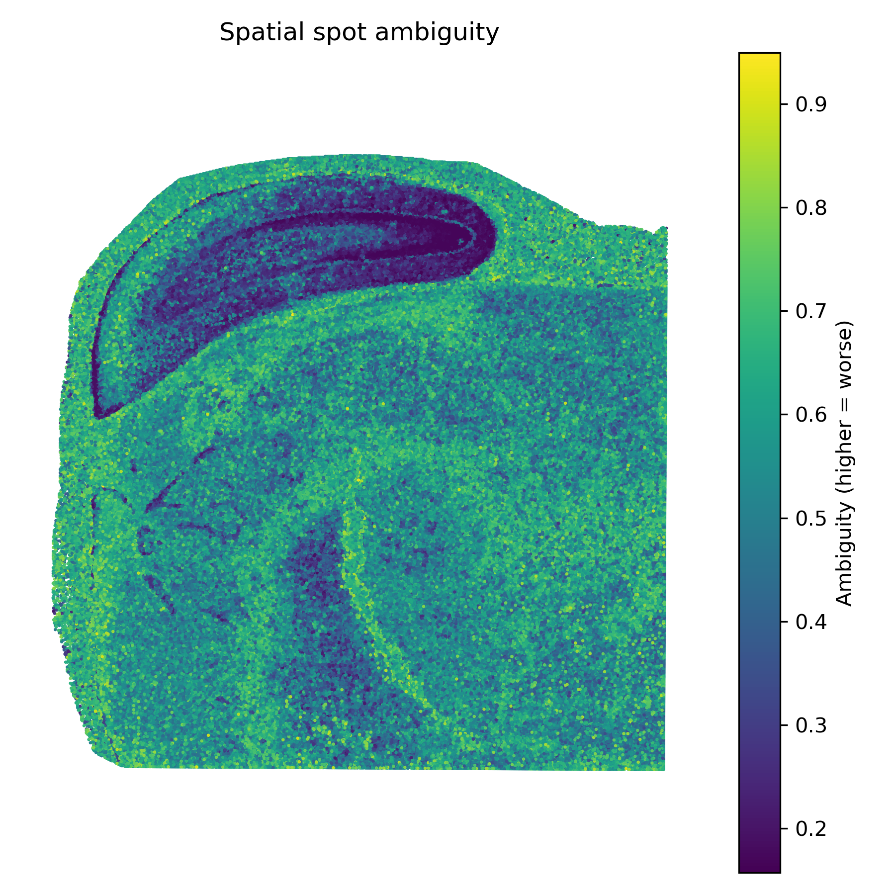

# Overview:
This pipeline performs perturbation-based clustering on 10x visium spatial transcriptomics data to quantify cluster stability and uncertainty. It takes a standard space ranger output folder and builds a set of 
CSV/Parquet files and plots describing local/global co-clustering stability, perturbation metadata, and neighborhood-based uncertainty metrics.
- Currently works for 16um and 8um fresh-frozen bin sizes (still being optimized for 2um and FFPE data)

# About:

## Motivation:
One of my goals during the 2025/26 winter break was to get familiar with processing spatial transcriptomic data. As I tested spatial clustering parameters by running small perturbations and comparing the resulting maps side-by-side, the idea occured to me that the consistency of a spot’s neighborhood might be turned into a quantitative measure of confidence. In theory, if a spot repeatedly clusters with the same nearby spots across reasonable parameter variations, that suggests a stable signal, whereas if its assignments fluctuate, it may reflect boundary effects, mixed states, or technical noise.

## Problem:
Spot-based spatial transcriptomics trades resolution for scale, especially in-situ capturing (ISC) methods like 10x visium. While 10x has greatly shrunk the bin size all the way down from 16x16 to 2x2 um, the issue remains that bins can capture partial cells, overlapping cell processes, diffusion of transcripts, and segmentation or alignment noise, all of which contribute to some bins being an aggregate rather than a true single-cell readout, not to mention, the computational burdon for a 2x2 workflow can be extremely high. By standard workflows these mixed, ambiguous signals can be confidently misassigned to the wrong cell type or spatial domain. Deconvolution is commonly employed to fix this issue but it is not a perfect solution. As I found out during my testing, deconvolution depends greatly on the quality of the reference, can be sensitive to modeling assumptions, and doesn't do much to indicate which bins are robust versus ambiguous. This creates a practical issue, knowing where in the tissue the inferred labels are trustworthy, and where they should be treated cautiously—especially when downstream biological conclusions may hinge on small spatial boundaries or rare populations.

## Solution:
Attempt to create perturbations of various clustering parameters, track the cluster variation of each spot, and measure the consistency of each spot's neighborhood over perturbations using a kNN-type model. 

### Making the Perturbations:
...

### Calculating Stability: 

### Speed and Memory Optimizations:

## Example Figures:
-Soybean Data:
<table>
  <tr>
    <th align="center">16 µm bins</th>
    <th align="center">8 µm bins</th>
  </tr>
  <tr>
    <td align="center">
      
    </td>
    <td align="center">
      
    </td>
  </tr>
</table>

<table>
  <tr>
    <th align="center">16 µm bins</th>
    <th align="center">8 µm bins</th>
  </tr>
  <tr>
    <td align="center">
      
    </td>
    <td align="center">
      
    </td>
  </tr>
</table>
