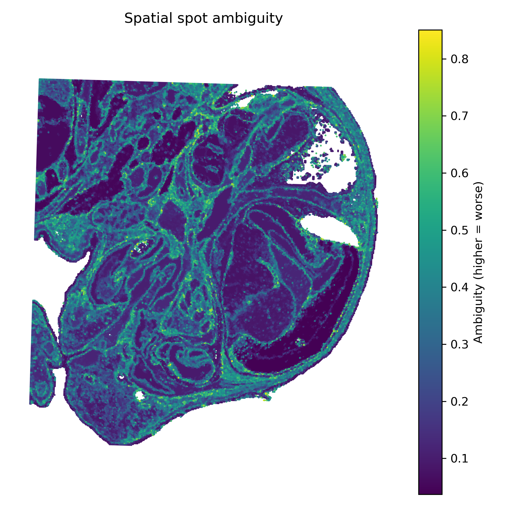
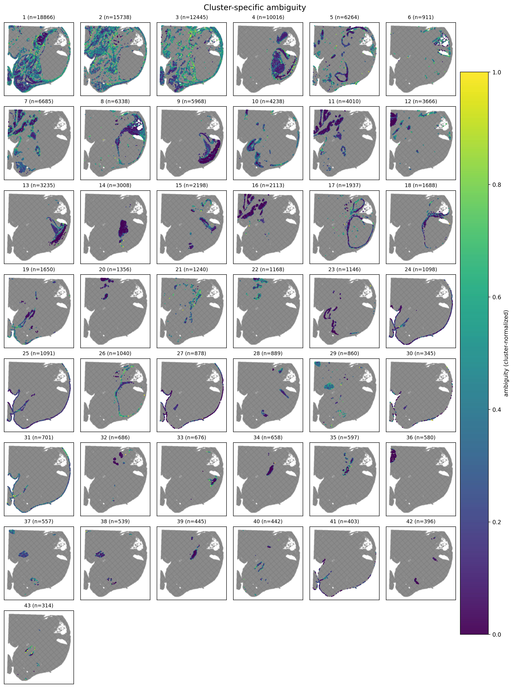
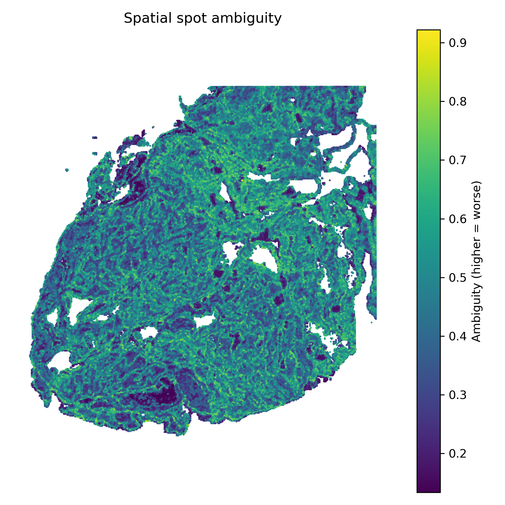
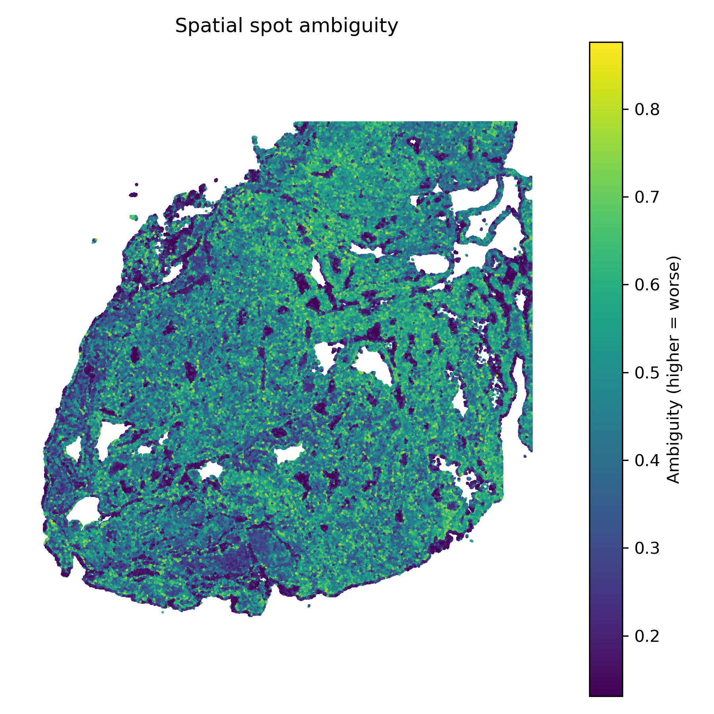
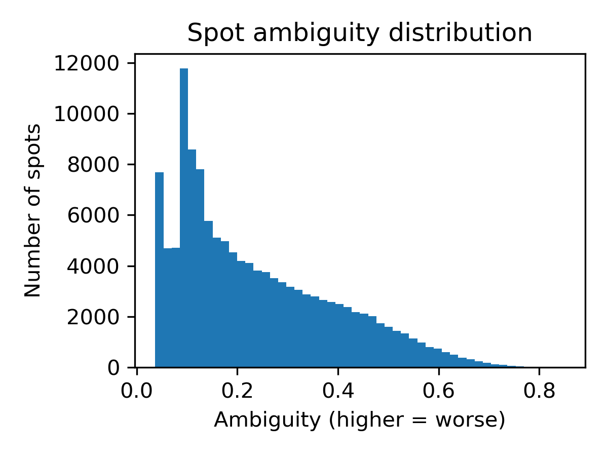
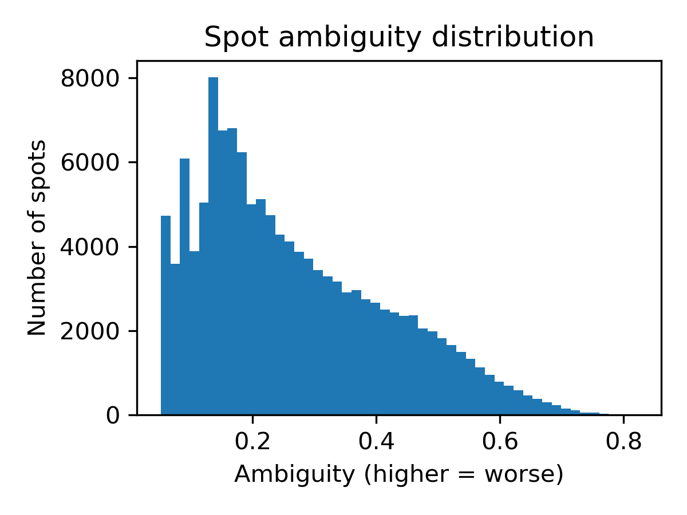
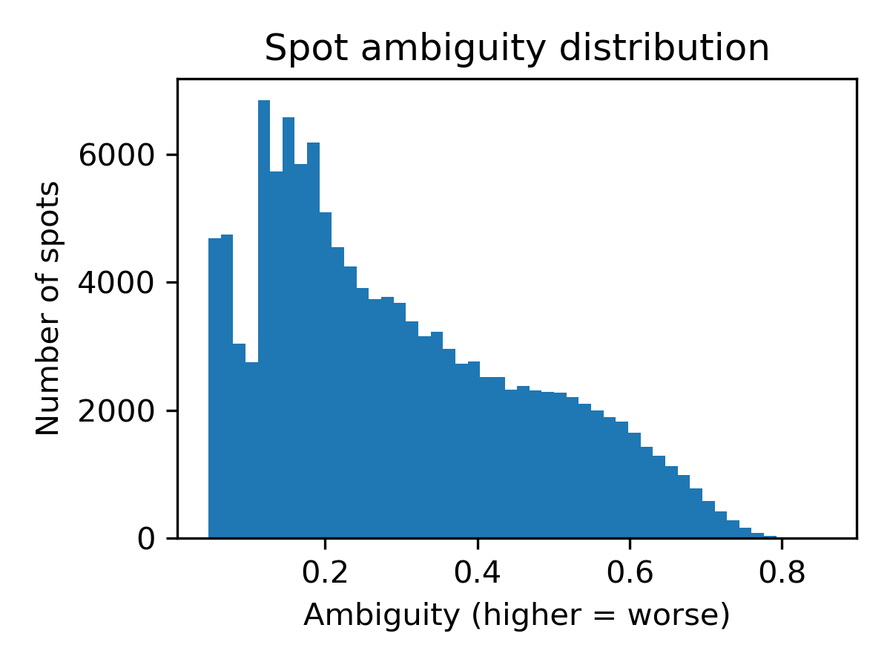
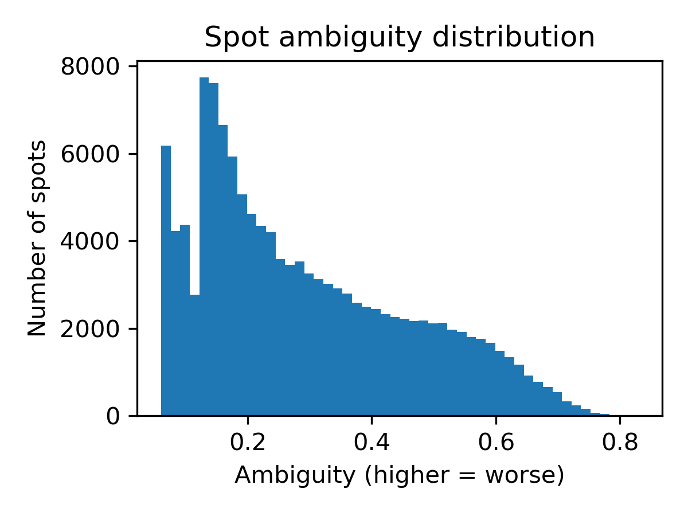
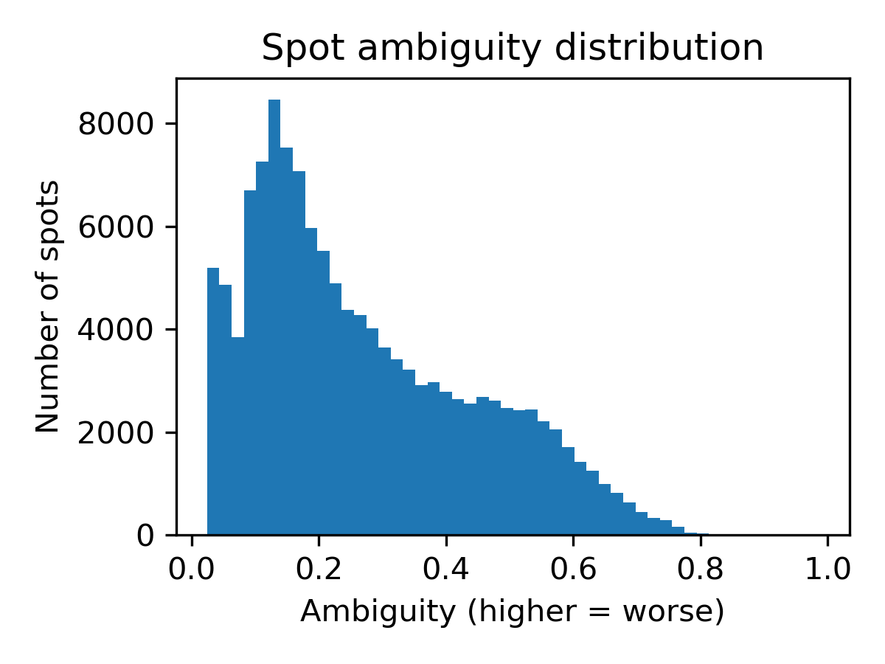

# Overview:
This pipeline performs perturbation-based clustering on 10x visium spatial transcriptomics data to quantify cluster stability and uncertainty. It takes a standard space ranger output folder and builds a set of 
CSV/Parquet files and plots describing local/global co-clustering stability, perturbation metadata, and neighborhood-based uncertainty metrics.
- Currently works for 16um and 8um fresh-frozen bin sizes (still being optimized for 2um and FFPE data)
- Currently runs on shared computing clusters that utilize SGE/Grid Engine–style queueing systems (working on extending to AWS)

# Usage:
### 1) Configure inputs
Edit `config.py`:
- `CONFIG["paths"]["data_path"]` -> path to your 10x/Visium dataset
- perturbation settings under `qc`, `graph`, `spatial`, etc.

### 2) Activate environment
Make sure your cluster environment has:
- Python with `scanpy`, `squidpy`, `pandas`, `numpy`, `scikit-learn`, `matplotlib`, `pyarrow`
- a Conda env named `spatial_analysis_env`
- `qsub` available

### 3) Run the full pipeline
```bash
bash run_pipeline.sh
```
This will:
1. generate perturbation parameter sets (perturbations.parquet)
2. split runs by estimated memory tier (8/16/32 GB)
3. submit array jobs for all perturbations
4. merge outputs into perturbations_expanded.parquet
5. compute Jaccard-based stability (spot_jaccard_stability.csv)
6. generate plots in figures/
   
Key outputs:
- perturbations_expanded.parquet
- spot_jaccard_stability.csv
- figures/ (histograms, spatial plots, ambiguity gallery)
- logs/ (runtime logs for each process)

# About:

## Motivation:
One of my goals during the 2025/26 winter break was to get familiar with processing spatial transcriptomic data. As I tested spatial clustering parameters by running small perturbations and comparing the resulting maps side-by-side, the idea occurred to me that the consistency of a spot’s neighborhood might be turned into a quantitative measure of confidence. In theory, if a spot repeatedly clusters with the same nearby spots across reasonable parameter variations, that suggests a stable signal, whereas if its assignments fluctuate, it may reflect boundary effects, mixed states, or technical noise.

## Problem:
Spot-based spatial transcriptomics trades resolution for scale, especially in-situ capturing (ISC) methods like 10x visium. While 10x has greatly shrunk the bin size all the way down from 16x16 to 2x2 um, the issue remains that bins can capture partial cells, overlapping cell processes, diffusion of transcripts, and segmentation or alignment noise, all of which contribute to some bins being an aggregate rather than a true single-cell readout, not to mention, the computational burdon for a 2x2 workflow can be extremely high. By standard workflows these mixed, ambiguous signals can be confidently misassigned to the wrong cell type or spatial domain. Deconvolution is commonly employed to fix this issue but it is not a perfect solution. As I found out during my testing, deconvolution depends greatly on the quality of the reference, can be sensitive to modeling assumptions, and doesn't do much to indicate which bins are robust versus ambiguous. This creates a practical issue, knowing where in the tissue the inferred labels are trustworthy, and where they should be treated cautiously—especially when downstream biological conclusions may hinge on small spatial boundaries or rare populations.

## Solution:
Create perturbations of various clustering parameters, track the cluster variation of each spot. Then measure the consistency of each spot's neighborhood over perturbations using a kNN-type model to see which spots . 

### Building the Perturbations (technical aspects):
- Perturbations are defined in the config.py file and built up-front in a single table (perturbations.parquet). Each row is one fully specified clustering run (unique run_id + parameter set). This makes the experiment reproducible and lets you submit the whole grid as an array job.
- The script takes a 1-based TASK_ID, loads exactly that row from perturbations.parquet, and runs it end-to-end. This helps with run time and makes it SGE/array-friendly.
- The specified parameters in config.py are intentionally “reasonable workflow variations,” but they can be changed based on situational preferences.
- Rather than hard thresholds that don’t scale across tissue/bin sizes, this pipeline computes per-run cutoffs via dataset quantiles of n_genes_by_counts and total_counts (gene_q, umi_q) instead of fixed cutoffs. This makes QC perturbations more comparable across datasets.
- I set min_cells = max(3, int(0.01 * n_obs)) so gene filtering scales with the number of spots and remains stable across different QC stringencies.
- Each run varies in n_hvgs which is capped by n_vars and attempts seurat_v3 with a fallback to cell_ranger. This had to be done to keep hvgs robust and prevent failure cases from biasing stability or completely breaking the clustering.
- When smooth > 0, the pipeline constructs a grid-based spatial adjacency, degree-normalizes it, and applies it iteratively "smooth times" so each spot is updated by a weighted average of its neighbors. This is done to prevent edge spots from being systematically biased because they have fewer neighbors than central spots.
- The pipeline switched scaling for memory-heavy perturbations (n_obs > 50,000) to sparse-friendly StandardScaler(with_mean=False) (otherwise sc.pp.scale) and clip values to [-10,10]. This allows my pipeline to run reasonably with larger 8um samples.
- n_pca varies per run but it caps at min(n_obs-1, n_vars-1) to avoid invalid PCA settings.
- The pipeline picks the PCA solver based on dataset size, trying randomized first for large datasets (otherwise arpack), and switching to the other solver if the first one fails.
- Random_seed is fixed to 42 for reproducibility.
- Each run writes either a success parquet or a failure parquet with the status, error, and parameters, and it uses .started and .tmp_failure files to flag incomplete runs. Runs that end up with too few spots or too few genes/HVGs after QC are flagged for error and stopped.
- Each perturbation writes a spot-level parquet with spot_id, cluster labels, cluster sizes, spatial coordinates, and the full parameter set to enable per-spot stability computation across runs. These parquets are merged into a single perurbations_expanded.parquet for downstream analysis.

### Calculating Stability (technical aspects: 
- First, the script factorizes spot_id and run_id into stable integer indices so all the downstream operations can be done efficiently in NumPy rather than repeated pandas joins which saves a lot of runtime.
- Spatial coordinates are then deduplicated per spot (generates a warning if any spot has inconsistent x/ys across runs) to guarantee that neighborhood structure is fixed and not overwritten by per-run rows.
- Final stability/ambiguity is measured as a combination of global and local stability. Local stability asks whether a spot’s label is consistent with its immediate spatial neighborhood across perturbations (which is good for detecting boundaries, mixed bins, and spatially incoherent assignments), while global stability asks whether its cluster membership remains consistent at the dataset-wide level (good for detecting overall clustering volatility or label switching).
- Local Stability:
  - The script builds a single k-nearest-neighbors graph from the deduplicated (x,y) coordinates and reuses this neighbor list for every perturbation run which saves a lot of time.
  - For each run pair, and for each spot, the script compares the set of neighbor positions that co-cluster with the spot in run 1 vs run 2 and computes a Jaccard similarity over those neighbor positions.
  - Disagreements are counted explicitly meaning that Jaccard = 0 is included instead of skipped, which avoids biasing stability upward.
- Global Stability:
  - The script compares cluster structure across runs without accounting for spatial proximity.
  - For each sampled run pair, it iterates over cluster pairs (C1, C2) and computes Jaccard(C1, C2) based on their spot membership.
  - That Jaccard value is then attributed only to the spots in the intersection C1 ∩ C2, meaning a spot’s global score reflects how consistently its cluster membership overlaps with a corresponding cluster across perturbations rather than being diluted by unrelated clusters.
- Because evaluating all run pairs can be expensive when the perturbation grid is large, the script optionally subsamples run pairs up to --max_run_pairs using a fixed random seed (--seed, default 42) so estimates are reproducible and runtime stays bounded.
- The global and local stabilities are combined into a single overall ambiguity score: ambiguity = α * (1 - local_stability) + β * (1 - global_stability) where α and β are specified in the command line arguments. The ability to modify these values on the fly allows you to emphasize whatever aspects of uncertainty you care about most (boundary mixing vs. overall clustering volatility). As a baseline I prefer to use α = 0.7-0.8 and β = 0.2-0.3. 

## Example Figures:
<table>
  <tr>
    <th align="center">Mouse Embryo Ambiguity Plot</th>
    <th align="center">Mouse Embryo Cluster-Specific Plots</th>
  </tr>
  <tr>
    <td align="center">
      
    </td>
    <td align="center">
      
    </td>
  </tr>
</table>

## Comparing 16um and 8um
<table>
  <tr>
    <th align="center">Ovarian Cancer 16 µm bins</th>
    <th align="center">Ovarian Cancer 8 µm bins</th>
  </tr>
  <tr>
    <td align="center">
      
    </td>
    <td align="center">
      
    </td>
  </tr>
</table>

## Why is the average ambiguity for the 8um samples sometimes higher?
- From what I've seen from testing, the 8um samples show more ambiguous regions because finer bins have less signal, and reveal more boundary/transition structure, so cluster labels flip more across perturbations; 16 µm averages more signal and is therefore more stable. I'm currently trying to figure out ways to work around this and make the scores scale more evenly across bin sizes.
- In some regions, the 8 um data is more stable, and these tend to fall in clusters that are more diffuse and widely dispersed.

## Comparing number of clustering variables (mouse embryo data):
<table>
  <tr>
    <th align="center">144 Perturbations</th>
    <th align="center">108 Perturbations</th>
   <th align="center">72 Perturbations</th>
  </tr>
  <tr>
    <td align="center">
      
    </td>
    <td align="center">
      
    </td>
     <td align="center">
      
    </td>
  </tr>
</table>

<table>
  <tr>
    <th align="center">48 Perturbations</th>
    <th align="center">32 Perturbations</th>
  </tr>
  <tr>
    <td align="center">
      
    </td>
    <td align="center">
      
    </td>
  </tr>
</table>

